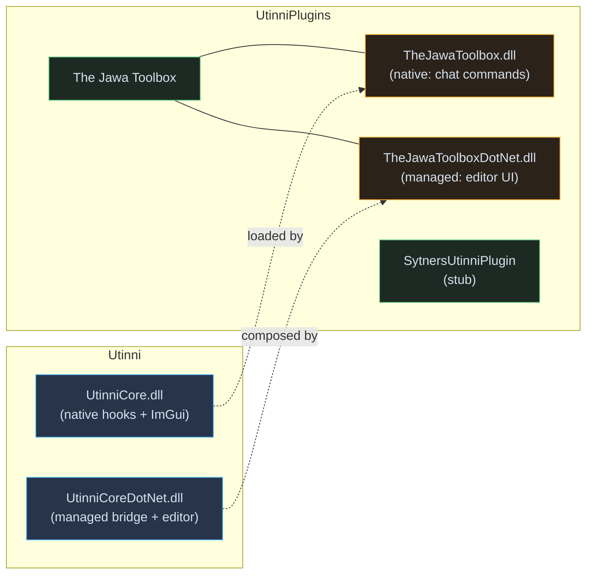

# UtinniPlugins — documentation

> **For humans:** open [`docs/index.html`](../index.html) for the navigable HTML
> doc set.

UtinniPlugins is the official plugin repository for [Utinni](../../Utinni/),
the SWG client modding framework. It contains:

- **The Jawa Toolbox** — the canonical reference editor plugin. World-snapshot
  node editor, object browser, free-cam, scene controls, time-of-day,
  graphics debug. Read this first if you're learning the conventions.
- **SytnersUtinniPlugin** — currently a placeholder header
  (`SytnersUtinniPlugin/sup.h`). Reserved for future work by James Webb
  (Sytner).

These are MIT-licensed forks of [ptklatt/UtinniPlugins](https://github.com/ptklatt/UtinniPlugins).

## What to read

| Topic                                       | For…                                                                    |
| ------------------------------------------- | ----------------------------------------------------------------------- |
| [The Jawa Toolbox](jawa-toolbox.md)         | Plugin authors learning idiomatic patterns by reading a complete plugin. |
| [Plugin patterns](patterns.md)              | The reusable design conventions extracted from the JT codebase.          |
| [`SytnersUtinniPlugin`](sytners.md)         | The placeholder, in case you're curious.                                 |

## Mental model

The Jawa Toolbox demonstrates Utinni's dual-language pattern:

- A **tiny C++ DLL** that hooks the chat window's command-parser registration
  so the plugin can add `/cam`, `/teleport`, `/reloadSnapshot`, etc. as
  in-game slash commands.
- A **large .NET DLL** that implements `IEditorPlugin` — owns several
  `SubPanel`s, an `IEditorForm` (the Object Browser), the gizmo wiring, the
  hotkeys, the undo command implementations, and per-feature `*Impl` classes.

## Cross-references

- The Utinni framework documentation is at
  [`../../Utinni/docs/`](../../../Utinni/docs/index.html). Read that first
  for the framework architecture — these docs assume you know it.
- The SDK / templates are in
  [`../../Utinni/sdk/`](../../../Utinni/sdk/) and documented at
  [`../../Utinni/docs/ai/sdk.md`](../../../Utinni/docs/ai/sdk.md).

## License

MIT — see `LICENSE` in repo root. Both repositories are forks; the intent is
to maintain them in step with the upstream community where possible and
otherwise advance the forks autonomously.
