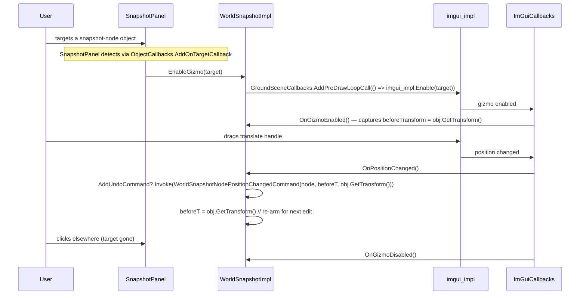

# The Jawa Toolbox

> The canonical Utinni editor plugin. Read this top-to-bottom and you'll
> recognise the conventions every other Utinni plugin uses.

## What it does

| Feature area               | Capabilities                                                                                                |
| -------------------------- | ----------------------------------------------------------------------------------------------------------- |
| **World-snapshot editing** | Add / remove / move / rotate / duplicate snapshot nodes. Full undo/redo. Gizmo-driven with snap support. Save / Save-As to `.ws`. |
| **Object browser**         | Floating form. TreeView of all object categories pulled from the running client's TRE files. Drag-from-list, drop-into-world creates a snapshot node. |
| **Scene controls**         | Load / unload / reload terrain. Pick avatar object. Set time-of-day. Cycle weather. Toggle modal chat.       |
| **Free-cam**               | Toggle free flight. Speed slider + half/double hotkeys. Teleport buttons. Drag-player option.               |
| **Player controls**        | Position / speed inputs. Teleport. Teleport-to-camera. Player-model visibility toggle.                      |
| **Graphics debug**         | Wireframe mode. Render skeleton bones. Reload textures.                                                     |
| **CUI helpers**            | Reload UI without restarting.                                                                                |
| **Slash commands**         | `/cam`, `/player`, `/speed`, `/teleport`, `/reloadSnapshot`, `/reloadTerrain`, `/reloadUI`, `/tod`, `/weather`. |

## Solution layout

```
TheJawaToolbox.sln                                  ← VS solution, x86/Win32, Debug/Release/RelWithDbgInfo
├── TheJawaToolbox/                                  ← C++ side
│   ├── TheJawaToolbox.vcxproj
│   ├── plugin.cpp                                   ← UtinniPlugin subclass + UTINNI_PLUGIN factory
│   └── swg/ui/
│       ├── tjt_command_parser.h
│       └── tjt_command_parser.cpp                   ← /cam, /player, /speed, /teleport, /reload*, /tod, /weather
└── TheJawaToolboxDotNet/                            ← C# side (IEditorPlugin)
    ├── TheJawaToolboxDotNet.csproj
    ├── Plugin.cs                                    ← IEditorPlugin entry
    │
    ├── UI/SubPanels/                                ← right-rail SubPanels
    │   ├── ScenePanel.cs       (+ .Designer / .resx)
    │   ├── SnapshotPanel.cs
    │   ├── PlayerPanel.cs
    │   ├── FreeCamPanel.cs
    │   ├── GraphicsPanel.cs
    │   └── MiscPanel.cs
    │
    ├── UI/Forms/                                    ← IEditorForms
    │   └── FormObjectBrowser.cs
    │
    ├── Impl/                                        ← business logic, one per feature area
    │   ├── WorldSnapshotImpl.cs                     ← snapshot CRUD + gizmo integration (~560 lines)
    │   ├── GroundSceneImpl.cs                        ← terrain / weather / time-of-day
    │   ├── FreeCamImpl.cs                            ← free-cam state
    │   ├── PlayerObjectImpl.cs                       ← player position / speed / teleport
    │   ├── GraphicsImpl.cs                           ← wireframe / skeleton / texture reload
    │   ├── CuiImpl.cs                                ← UI reload
    │   └── MiscImpl.cs                               ← misc
    │
    ├── Commands/                                    ← plugin-specific IUndoCommand subclasses (when needed beyond Utinni's built-ins)
    │   └── ...
    │
    └── settings.ini (built artifact)
```

Both projects build into:

```
<install>/Plugins/TheJawaToolbox/
├── TheJawaToolbox.dll
├── TheJawaToolboxDotNet.dll
├── settings.ini      (created on first run from defaults)
└── input.ini         (HotkeyManager persistence)
```

`TheJawaToolboxDotNet` references `TheJawaToolbox` as a project dependency so
the C++ side builds first.

## C++ side

### `plugin.cpp`

```cpp
class TheJawaToolboxPlugin : public utinni::UtinniPlugin
{
    Information info = { "The Jawa Toolbox",
                         "Snapshot/object/scene editor for SWG",
                         "Timbab" };

public:
    TheJawaToolboxPlugin()
    {
        utinni::CuiChatWindow::addCreateCommandParserCallback(
            &tjt::TheJawaToolboxCommandParser::create);
    }

    const Information& getInformation() override { return info; }
};

UTINNI_PLUGIN { return new TheJawaToolboxPlugin(); }
```

That's the entire native side outside of the command parser — about 30
lines. The pattern is:

> The C++ DLL exists only to register a native command parser. All real work
> happens in C#.

This is the right shape for almost any new editor plugin: a thin C++ shim
to bridge anything that has to happen on the SWG side of the boundary, and
all the editor surface in managed code.

### `tjt_command_parser.cpp`

Subclasses `utinni::CommandParser`, registers the 9 commands listed in the
feature table above. Each command directly calls a UtinniCore API:

```cpp
bool TheJawaToolboxCommandParser::performParsing(
    const int64_t& userId,
    const std::vector<swg::WString>& args,
    const wchar_t* originalCommand,
    const wchar_t* result,
    const CommandParser* node) override
{
    if (node->getName() == "cam") {
        utinni::GroundScene::get()->toggleFreeCamera();
        return true;
    }
    if (node->getName() == "tod") {
        float t = std::stof(swg::wstringToString(args[0]));
        utinni::Terrain::get()->setTimeOfDay(t);
        return true;
    }
    // ... etc.
    return false;
}
```

Why command-parser hooks in C++ instead of C#? The parser is constructed from
within `CuiChatWindow`'s constructor, on the game thread, long before the
CLR is fully serviceable. Registering a native parser is the lowest-friction
way to plug in. The result is callable from both directions:

- User types `/cam` in chat → goes through native parser → toggles free-cam.
- C# button click queues the same `GroundScene.Get().ToggleFreeCamera()` —
  identical effect.

## .NET side

### `Plugin.cs` — `IEditorPlugin`

```csharp
public class TheJawaToolboxPlugin : IEditorPlugin
{
    public PluginInformation Information { get; }
    public EventHandler<AddUndoCommandEventArgs> AddUndoCommand { get; set; }

    public UtINI Settings { get; }     // settings.ini next to the DLL

    private readonly HotkeyManager hotkeys;

    // Feature implementations
    private readonly GroundSceneImpl    sceneImpl;
    private readonly WorldSnapshotImpl  snapshotImpl;
    private readonly FreeCamImpl        freeCamImpl;
    private readonly PlayerObjectImpl   playerImpl;
    private readonly GraphicsImpl       graphicsImpl;
    private readonly CuiImpl            cuiImpl;
    private readonly MiscImpl           miscImpl;

    public TheJawaToolboxPlugin()
    {
        Information = new PluginInformation("The Jawa Toolbox", "...", "Timbab");
        Settings    = new UtINI("settings.ini");
        hotkeys     = new HotkeyManager(onGameFocusOnly: false);

        sceneImpl    = new GroundSceneImpl   (Settings, hotkeys);
        snapshotImpl = new WorldSnapshotImpl (Settings, hotkeys, this);
        freeCamImpl  = new FreeCamImpl       (Settings, hotkeys);
        playerImpl   = new PlayerObjectImpl  (Settings, hotkeys);
        graphicsImpl = new GraphicsImpl      (Settings, hotkeys);
        cuiImpl      = new CuiImpl           (Settings, hotkeys);
        miscImpl     = new MiscImpl          (Settings, hotkeys);

        hotkeys.CreateSettings();
        Settings.Load();
    }

    public UtINI GetConfig() => Settings;
    public HotkeyManager GetHotkeyManager() => hotkeys;

    public List<IEditorForm> GetForms() => new List<IEditorForm>
    {
        new FormObjectBrowserDef(this, snapshotImpl)
    };

    public List<SubPanelContainer> GetStandalonePanels()
    {
        var c = new SubPanelContainer("Controls");
        c.Add(new ScenePanel(sceneImpl));
        c.Add(new SnapshotPanel(snapshotImpl, this));
        c.Add(new PlayerPanel(playerImpl));
        c.Add(new FreeCamPanel(freeCamImpl));
        c.Add(new GraphicsPanel(graphicsImpl));
        c.Add(new MiscPanel(miscImpl));
        return new List<SubPanelContainer> { c };
    }

    public List<SubPanel> GetSubPanels() => null;
}
```

The key pattern is **separating UI from logic**: every panel is a thin
`SubPanel` whose constructor takes an interface (or just a reference) to the
`*Impl` class that owns the actual work. The `*Impl` classes own all callback
registration, hotkey definitions, undo command emission, and INI settings.
The panels just wire button-clicks → `*Impl` methods.

### Feature implementations (`Impl/`)

Each `*Impl` class follows the same recipe:

1. **Constructor** takes a shared `UtINI` (for settings) and `HotkeyManager`.
2. **`CreateSettings()`** seeds INI defaults for this feature's section.
3. **Subscribes to callbacks** in the constructor:
   - `GameCallbacks.AddInstallCallback`/`AddSetupSceneCall`/`AddCleanupSceneCall` for lifecycle.
   - `GroundSceneCallbacks.AddUpdateLoopCall` for per-frame state polling.
   - `ImGuiCallbacks` for gizmo events.
   - `ObjectCallbacks` for target changes.
4. **Registers hotkeys** in the shared `HotkeyManager`.
5. **Exposes public methods** the panel calls (`Load`, `Save`, `Toggle`,
   `MoveByDelta`, etc.).

Example (sketch of `GroundSceneImpl`):

```csharp
public class GroundSceneImpl
{
    private readonly UtINI ini;
    private readonly HotkeyManager hotkeys;

    public GroundSceneImpl(UtINI ini, HotkeyManager hotkeys)
    {
        this.ini = ini;
        this.hotkeys = hotkeys;

        ini.AddSetting("Scene", "defaultTerrainFilename", "terrain/naboo.trn", VtString);
        ini.AddSetting("Scene", "defaultAvatarFilename",
                       "object/creature/player/shared_human_male.iff", VtString);
        ini.AddSetting("Scene", "forceModalChat", "true", VtBool);

        GameCallbacks.AddInstallCallback(() => PopulateTerrainList());
        Task.Run(() => PollTimeOfDay());   // async UI updater
    }

    public void Load(string sceneName, string avatarFilename)
        => GameCallbacks.AddMainLoopCall(() => Game.LoadScene(sceneName, avatarFilename));

    public void Reload()  => GameCallbacks.AddMainLoopCall(() => GroundScene.Get().ReloadTerrain());
    public void Unload()  => GameCallbacks.AddMainLoopCall(() => Game.CleanupScene());

    public void SetTimeOfDay(float t)
        => GroundSceneCallbacks.AddUpdateLoopCall(() => Terrain.Get().SetTimeOfDay(t));

    public void SetWeather(int idx)
        => GroundSceneCallbacks.AddUpdateLoopCall(() => Terrain.Get().SetWeather(idx));

    private async Task PollTimeOfDay() { /* read from game thread, marshal to UI */ }
    private void PopulateTerrainList() { /* read TreeFile filenames, raise event for panel */ }
}
```

## Snapshot editing — the deep dive

`WorldSnapshotImpl` is the largest of the `*Impl` classes (~560 lines) and
illustrates every Utinni concept at once.

### Callbacks wired in constructor

```csharp
GameCallbacks.AddInstallCallback(OnInstall);
GameCallbacks.AddSetupSceneCall(OnSetupScene);
GameCallbacks.AddCleanupSceneCall(OnCleanupScene);

ObjectCallbacks.AddOnTargetCallback(OnTargetChanged);

ImGuiCallbacks.AddOnEnabledCallback(OnGizmoEnabled);
ImGuiCallbacks.AddOnDisabledCallback(OnGizmoDisabled);
ImGuiCallbacks.AddOnPositionChangedCallback(OnPositionChanged);
ImGuiCallbacks.AddOnRotationChangedCallback(OnRotationChanged);
```

### Snapshot CRUD

| Public method                  | Action                                                                                                      | Undo? |
| ------------------------------ | ----------------------------------------------------------------------------------------------------------- | ----- |
| `Load(name)`                   | Defer → `WorldSnapshot.Load(name)`                                                                          | No    |
| `Unload()`                     | `WorldSnapshot.Unload()`                                                                                     | No    |
| `Reload()`                     | `WorldSnapshot.Reload()`                                                                                     | No    |
| `Save()` / `SaveAs(path)`      | `WorldSnapshotReaderWriter.Get().SaveFile()`                                                                | No    |
| `AddNode(filename)`            | Construct node, push `AddWorldSnapshotNodeCommand` (Utinni built-in)                                         | Yes   |
| `RemoveNode()`                 | Push `RemoveWorldSnapshotNodeCommand` with a stored copy                                                     | Yes   |
| `SetNodePosition(x,y,z)`       | Compute new transform, push `WorldSnapshotNodePositionChangedCommand` with before/after                      | Yes   |
| `RotateYaw/Pitch/Roll(deg)`    | Multiply transform by rotation, push `WorldSnapshotNodeRotationChangedCommand`                              | Yes   |
| `Copy/Paste/Duplicate Node`    | Clipboard storage in-memory; paste creates a new node + add-undo command                                    | Yes   |

### Gizmo integration

Gizmo lifecycle is event-driven:



The `beforeTransform` re-arming after each push means each gizmo drag is one
clean undo step even if the user releases-and-grabs repeatedly.

### Hotkeys registered

```csharp
hotkeys.Add(new Hotkey {
    Name = "ToggleSnapshotNodeEditingMode",
    Text = "Toggle snapshot node editing",
    Key = Keys.Oemtilde, ModifierKeys = Keys.None,
    OnDownCallback = ToggleNodeEditing,
    Enabled = true, OnGameFocusOnly = true, OverrideGameInput = true
});

hotkeys.Add(new Hotkey {
    Name = "SaveSnapshot",
    Text = "Save snapshot",
    Key = Keys.S, ModifierKeys = Keys.Control,
    OnDownCallback = Save, OnGameFocusOnly = true
});

hotkeys.Add(new Hotkey {
    Name = "CopySnapshotNode",     Key = Keys.C, ModifierKeys = Keys.Control, ...
});
hotkeys.Add(new Hotkey {
    Name = "DeleteSnapshotNode",   Key = Keys.Delete, ModifierKeys = Keys.None, ...
});
hotkeys.Add(new Hotkey {
    Name = "SetGizmoTranslateOperationMode",
    Key = Keys.Q, ModifierKeys = Keys.Control,
    OnDownCallback = () => imgui_impl.SetOperationModeToTranslate()
});
hotkeys.Add(new Hotkey {
    Name = "SetGizmoRotationOperationMode",
    Key = Keys.E, ModifierKeys = Keys.Control,
    OnDownCallback = () => imgui_impl.SetOperationModeToRotate()
});
```

The gizmo-mode hotkeys are toggled by `OnGizmoEnabled` / `OnGizmoDisabled`:

```csharp
private void OnGizmoEnabled()
{
    hotkeys.Hotkeys["SetGizmoTranslateOperationMode"].Enabled = true;
    hotkeys.Hotkeys["SetGizmoRotationOperationMode"].Enabled  = true;
}
```

— a clean pattern for context-sensitive shortcuts.

### Settings

```ini
[Snapshot]
defaultSnapshotName        = naboo
defaultNodeObjectFilename  = object/tangible/furniture/cheap/shared_armoire_s01.iff
autoEnableSnapshotEditing  = false
autoAllowTargetEverything  = false
```

Read once on construct; can be updated by panel controls and re-saved.

## Object browser

`FormObjectBrowser` is the only `IEditorForm` JT registers — it's a separate,
modeless, dockable tool window. Highlights:

### Repository scan

```csharp
private async Task LoadRepo()
{
    while (!Game.IsRunning) await Task.Delay(100);

    var filenames = TreeFile.GetAllFilenames()         // all loaded TRE filenames
                     .Where(f => f.StartsWith("object/"))
                     .Where(f => !ExcludedCategories.Any(c => f.StartsWith($"object/{c}/")));

    var tree = BuildTreeFromPaths(filenames);

    this.BeginInvoke((MethodInvoker)(() =>
    {
        treeViewCategories.BeginUpdate();
        BindTree(tree);
        treeViewCategories.EndUpdate();
    }));
}
```

`ExcludedCategories = { "cell", "factory", "group", "guild", "mission", "player", "token", "universe", "waypoint", ... }`
— stuff that is technically `object/...` but not useful in a snapshot.

### Drag-drop into the world

```csharp
private void lbFiles_MouseMove(object s, MouseEventArgs e)
{
    if (e.Button == MouseButtons.Left && draggedFile != null)
        DoDragDrop(draggedFile, DragDropEffects.Copy);
}

// In constructor:
GameDragDropEventHandlers.OnDragEnter += HandleDragEnter;
GameDragDropEventHandlers.OnDragOver  += HandleDragOver;
GameDragDropEventHandlers.OnDragDrop  += HandleDragDrop;
```

```csharp
private Object dragPreview;

private void HandleDragEnter(object s, DragEventArgs e)
{
    var filename = (string)e.Data.GetData(typeof(string));
    GroundSceneCallbacks.AddPreDrawLoopCall(() =>
    {
        dragPreview = CreateTemporaryObject(filename);
        renderWorld.AddObjectNotifications(dragPreview);
    });
}

private void HandleDragOver(object s, DragEventArgs e)
{
    var screenPoint = new Point(e.X, e.Y);
    var clientPoint = panelGame.PointToClient(screenPoint);
    GroundSceneCallbacks.AddPreDrawLoopCall(() =>
    {
        var hit = cui_hud.CollideCursorWithWorld(clientPoint.X, clientPoint.Y);
        if (hit.IsValid && dragPreview != null)
            dragPreview.SetTransform(new Transform(hit.Position, dragPreview.GetTransform().Rotation));
    });
}

private void HandleDragDrop(object s, DragEventArgs e)
{
    GroundSceneCallbacks.AddPreDrawLoopCall(() =>
    {
        var pos = dragPreview.GetTransform().Position;
        snapshotImpl.AddNodeAt(pos, dragPreview.GetTemplateName());
        DestroyTemporaryObject(dragPreview);
        dragPreview = null;
    });
}
```

`CollideCursorWithWorld` lives in the `cui_hud` shim — it does the same
mouse-ray-into-world test SWG uses for click-to-walk.

### Settings

```ini
[ObjectBrowser]
width                   = 525
height                  = 510
keepOnTop               = true
excludeJunkDirectories  = true
```

`KeepOnTop` is exposed as a hotkey:

```ini
ToggleObjectBrowserKeepOnTop = Shift+Control+T
```

## Reusable patterns

See [patterns](patterns.md) for the cross-cutting design ideas distilled from
this codebase. Highlights:

- **Composition over inheritance.** No deep class hierarchies.
- **One `*Impl` class per feature area.** Panels are thin presentation.
- **All game-API calls deferred via callbacks.** Never call directly from UI
  handlers.
- **Hotkeys with scope flags + dynamic enable.** Context-sensitive shortcuts
  without messy if/else chains.
- **Undo through events.** Plugin never touches the stack — it raises
  `AddUndoCommand`.
- **Settings as composition root.** One `UtINI` instance passed to every
  feature; each feature defines its own section.
- **`Task` + `BeginInvoke` for async UI.** Polling loops decoupled from
  rendering.

## Build output

```
<install>/Plugins/TheJawaToolbox/
├── TheJawaToolbox.dll
├── TheJawaToolboxDotNet.dll
├── settings.ini
└── input.ini
```

`ut.ini`:

```ini
[Plugins]
plugin_0 = true,TheJawaToolbox
```

## See also

- [Plugin patterns](patterns.md)
- [Utinni docs: Plugin framework](../../../Utinni/docs/ai/plugin-framework.md)
- [Utinni docs: Callbacks reference](../../../Utinni/docs/ai/callbacks.md)
- [Utinni docs: UI framework](../../../Utinni/docs/ai/ui-framework.md)
- [Utinni docs: Tutorial](../../../Utinni/docs/ai/tutorial.md) — the
  walk-through for building a small plugin uses the same patterns.
